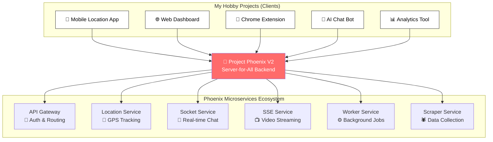
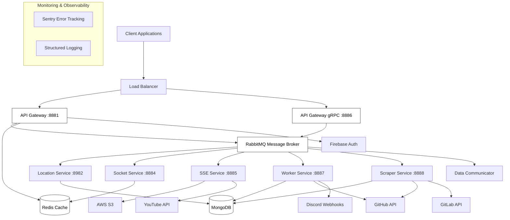

# 🚀 Project Phoenix V2

[](https://golang.org/)
[](https://microservices.io/)
[](https://www.docker.com/)
[](https://github.com/features/actions)

> **A personal hobby project that evolved into a production-grade, event-driven microservices platform - serving as the unified backend infrastructure for all my side projects and experiments.**

## 🎯 What is Project Phoenix V2?

**Project Phoenix V2** is my **"Server-for-All"** - a comprehensive microservices ecosystem that I built as a hobby project to serve as the backbone infrastructure for all my other side projects. Think of it as my personal AWS, but built from scratch in Go.

### The Story Behind Phoenix

What started as a simple Node.js server for one project grew into something much bigger. I realized I was rebuilding the same infrastructure components (authentication, file storage, real-time communication, background jobs) for every new hobby project. So I decided to build **one platform to rule them all**.

**The Go Migration Journey**: After working extensively in the JavaScript ecosystem, I wanted to **learn Go** and experience firsthand how it compares to Node.js in terms of performance, concurrency, and developer experience. **Project Phoenix V2** became my vehicle for this exploration - a complete rewrite that let me dive deep into Go's strengths while building something genuinely useful.

**Project Phoenix V2** is the Go rewrite of my original Node.js version, designed to be:
- **A learning laboratory** for mastering Go's concurrency patterns, type system, and ecosystem
- **A performance benchmark** to see how Go's speed claims hold up in real-world scenarios
- **The single backend** that powers multiple frontend applications
- **A showcase** of production-grade architecture patterns applied to personal projects
- **A reusable foundation** that eliminates repetitive infrastructure work

### What Makes This Special?

This isn't just another CRUD API. It's a **full-featured platform** that provides:

🔐 **Authentication & Sessions** - So my projects don't need their own auth  
📁 **File Storage & Streaming** - Direct video streaming, S3 integration  
🔄 **Real-time Communication** - WebSockets, SSE for live features  
⚙️ **Background Processing** - Scheduled jobs, API validation, scraping  
📍 **Location Services** - GPS tracking for mobile apps  
🤖 **AI/LLM Integration** - Ready-to-use AI capabilities  
📊 **Monitoring & Logging** - Built-in observability for all projects  

Instead of building these from scratch for each project, I just connect to Phoenix and focus on the unique business logic.

## 🏗️ The "Server-for-All" Architecture

Phoenix acts as a **unified backend platform** where each microservice handles a specific domain that my hobby projects commonly need. Multiple frontend applications (web apps, mobile apps, Chrome extensions, etc.) connect to this single backend infrastructure.

### How My Projects Use Phoenix



## 🏗️ Detailed Architecture Overview



## 🎯 Core Microservices

### 🌐 **API Gateway** (`api-gateway`)
- **Purpose**: Central HTTP entry point with session management and authentication
- **Features**: 
  - Middleware-based authentication pipeline
  - CORS handling and request validation
  - Session state management with Redis
  - Rate limiting and request throttling
- **Tech Stack**: Gorilla Mux, Firebase Auth, Redis Sessions

### 🔌 **API Gateway gRPC** (`api-gateway-grpc`)
- **Purpose**: High-performance gRPC interface for device communication
- **Features**:
  - Protocol Buffers for efficient serialization
  - Screen capture service integration
  - Bi-directional streaming support
- **Tech Stack**: gRPC, Protocol Buffers

### 📍 **Location Service** (`location-service`)
- **Purpose**: Real-time geolocation tracking and trip management
- **Features**:
  - MongoDB transactions for atomic operations
  - Real-time location updates via message broker
  - Trip history and analytics
  - TTL indexes for automatic data cleanup
- **Tech Stack**: MongoDB with transactions, Go-Micro

### 🔌 **Socket Service** (`socket-service`)
- **Purpose**: WebSocket-based real-time communication
- **Features**:
  - Multi-room clipboard sharing
  - Real-time location broadcasting
  - Connection pooling and management
  - Graceful disconnection handling
- **Tech Stack**: Gorilla WebSocket, Socket.IO

### 📡 **SSE Service** (`sse-service`)
- **Purpose**: Server-Sent Events for streaming and notifications
- **Features**:
  - Direct video streaming (yt-dlp integration)
  - AWS S3 file upload with presigned URLs
  - Real-time progress notifications
  - Streaming without intermediate storage
- **Tech Stack**: Server-Sent Events, AWS S3, yt-dlp

### ⚙️ **Worker Service** (`worker-service`)
- **Purpose**: Background job processing and scheduled tasks
- **Features**:
  - API key validation with provider-specific validators
  - Scheduled validation cycles (configurable intervals)
  - Discord webhook notifications
  - Concurrent processing with semaphore limiting
  - Credit tracking and quota management
- **Tech Stack**: Reflection-based handlers, Discord API

### 🕷️ **Scraper Service** (`scraper-service`)
- **Purpose**: GitHub/GitLab API scraping with intelligent rate limiting
- **Features**:
  - Multi-provider API key discovery
  - Rate limit handling with exponential backoff
  - Duplicate detection and deduplication
  - Configurable search patterns
  - Size-based search optimization
- **Tech Stack**: GitHub API, GitLab API, MongoDB

### 📨 **Data Communicator** (`data-communicator`)
- **Purpose**: Event relay and inter-service communication
- **Features**:
  - Message transformation and routing
  - Event aggregation and filtering
  - Service health monitoring
- **Tech Stack**: Go-Micro, RabbitMQ

## 🛠️ Technology Stack

### **Core Technologies**
- **Language**: Go 1.25
- **Framework**: Go-Micro v4 (Microservices framework)
- **Message Broker**: RabbitMQ with durable queues
- **Databases**: MongoDB (primary), PostgreSQL, Redis (caching)
- **Containerization**: Docker with multi-stage builds

### **Communication Protocols**
- **HTTP/REST**: Gorilla Mux router with middleware
- **gRPC**: High-performance RPC with Protocol Buffers
- **WebSocket**: Real-time bidirectional communication
- **Server-Sent Events**: Streaming data to clients
- **Message Queues**: Asynchronous event-driven communication

### **Cloud & External Services**
- **AWS S3**: File storage with presigned URLs
- **Firebase**: Authentication and user management
- **GitHub/GitLab APIs**: Repository and code analysis
- **Discord**: Webhook notifications
- **Sentry**: Error tracking and monitoring

## 🚀 Advanced Features

### **Event-Driven Architecture**
- **Asynchronous Communication**: Services communicate via RabbitMQ topics
- **Retry Logic**: Automatic retry with exponential backoff (up to 6 attempts)
- **Dead Letter Queues**: Failed message handling and recovery
- **Topic-based Routing**: Dynamic message routing based on content

### **Resilience & Reliability**
- **Connection Pooling**: MongoDB connection pool (10 connections)
- **Graceful Degradation**: Services handle broker disconnections
- **Circuit Breaker Pattern**: Prevents cascade failures
- **Health Checks**: Comprehensive service health monitoring

### **Performance Optimizations**
- **Streaming Architecture**: Direct stdout streaming (no buffering)
- **Concurrent Processing**: Semaphore-limited goroutines
- **TTL Indexes**: Automatic data expiration
- **Connection Reuse**: HTTP client connection pooling

### **Developer Experience**
- **Reflection-Based Handlers**: Dynamic topic subscription
- **Factory Pattern**: Centralized service instantiation
- **Middleware Chain**: Composable request processing
- **Structured Logging**: Correlation ID tracking

## 📊 System Metrics

- **Services**: 8 independent microservices
- **Protocols**: 4 communication protocols (HTTP, gRPC, WebSocket, SSE)
- **Databases**: 3 database technologies (MongoDB, PostgreSQL, Redis)
- **External APIs**: 5+ integrated services
- **Deployment**: Zero-downtime rolling updates

## 🔧 Quick Start

### Prerequisites
- Go 1.25+
- Docker & Docker Compose
- RabbitMQ (or use Docker)
- MongoDB (or use Docker)

### Installation

1. **Clone the repository**
   ```bash
   git clone https://github.com/wahajnintyeight/project-phoenix-v2.git
   cd project-phoenix-v2
   ```

2. **Environment setup**
   ```bash
   cp .env.example .env
   # Edit .env with your configuration
   ```

3. **Start with Docker Compose**
   ```bash
   docker compose up --build -d
   ```

4. **Or run individual services**
   ```bash
   # API Gateway
   go run main.go --service-name api-gateway --port 8881
   
   # Location Service
   go run main.go --service-name location-service --port 8982
   
   # Worker Service
   go run main.go --service-name worker-service --port 8887
   ```

## 🐳 Docker Deployment

### Build and Deploy
```bash
# Build all services
docker compose up --build -d

# View logs
docker logs --follow ppv2-api-gateway

# Scale services
docker compose up --scale worker-service=3 -d
```

### Individual Service Management
```bash
# Build specific service
docker build -t api-gateway -f pkg/service/apigateway/Dockerfile .

# Run with custom configuration
docker run -d -p 8881:8881 --env-file .env api-gateway
```

## 📈 CI/CD Pipeline

The project includes a sophisticated GitHub Actions workflow:

- **Change Detection**: Only builds and deploys modified services
- **Multi-Platform Builds**: Supports linux/amd64 architecture
- **Zero-Downtime Deployment**: Rolling updates with health checks
- **Automated Testing**: Comprehensive test suite execution
- **Container Registry**: Automatic image publishing to GHCR

## 🔍 Service Discovery

Services are dynamically discoverable through:
- **Go-Micro Registry**: Service registration and discovery
- **RabbitMQ Topics**: Event-based service communication
- **Health Endpoints**: `/health` endpoints for monitoring
- **Metrics Endpoints**: `/metrics` for observability

## 📚 API Documentation

### REST Endpoints
- **API Gateway**: `http://localhost:8881/api/*`
- **Health Checks**: `http://localhost:888X/health`
- **Metrics**: `http://localhost:888X/metrics`

### gRPC Services
- **Screen Capture**: `localhost:8886` (Protocol Buffers)

### WebSocket Endpoints
- **Real-time Communication**: `ws://localhost:8884/socket.io/`

## 🧪 Testing

```bash
# Run all tests
go test ./...

# Test specific service
go test ./pkg/service/apigateway/...

# Integration tests
go test -tags=integration ./...
```

## 📊 Monitoring & Observability

- **Error Tracking**: Sentry integration for error monitoring
- **Structured Logging**: JSON-formatted logs with correlation IDs
- **Health Checks**: Comprehensive service health endpoints
- **Metrics**: Custom metrics for business logic monitoring
- **Distributed Tracing**: Request tracing across services

## 🤝 Contributing

1. Fork the repository
2. Create a feature branch (`git checkout -b feature/amazing-feature`)
3. Commit your changes (`git commit -m 'Add amazing feature'`)
4. Push to the branch (`git push origin feature/amazing-feature`)
5. Open a Pull Request

## 📄 License

This project is licensed under the MIT License - see the [LICENSE](LICENSE) file for details.

## 🚀 Why Go? The Migration Story

Coming from years of JavaScript/Node.js development, I was curious about Go's performance claims and wanted to experience the language firsthand. **Project Phoenix V2** became my comprehensive Go learning project.

### 📊 **JavaScript vs Go: Real-World Comparison**

| Aspect | Node.js V1 | Go V2 | Improvement |
|--------|------------|-------|-------------|
| **Startup Time** | ~3-5 seconds | ~200ms | **15-25x faster** |
| **Memory Usage** | ~150-200MB per service | ~20-40MB per service | **4-5x more efficient** |
| **Concurrent Connections** | ~1,000 (with clustering) | ~10,000+ (goroutines) | **10x+ improvement** |
| **CPU Usage** | High during I/O operations | Minimal (efficient scheduler) | **Significantly lower** |
| **Build Size** | ~50MB+ (with node_modules) | ~15-25MB (static binary) | **2-3x smaller** |
| **Deployment** | Complex (runtime + dependencies) | Simple (single binary) | **Much simpler** |

## 🎨 Real-World Usage Examples

**The Good:**
- **Goroutines are magical**: Handling 10,000+ concurrent connections feels effortless
- **Static typing catches bugs**: Compile-time error detection vs runtime surprises
- **Single binary deployment**: No more "works on my machine" issues
- **Memory efficiency**: Garbage collector is surprisingly good
- **Standard library**: Comprehensive and well-designed
- **Cross-compilation**: Build for any platform from anywhere

**The Challenges:**
- **Error handling**: More verbose than try/catch, but forces you to think about failures
- **Package management**: Go modules vs npm - different philosophy but works well
- **Learning curve**: Coming from dynamic typing took adjustment
- **Ecosystem**: Smaller but higher quality packages

**The Verdict:** Go's performance claims are **absolutely real**. The combination of low memory usage, fast startup times, and excellent concurrency made the migration worthwhile for learning and performance gains.

Here's how my actual hobby projects leverage Phoenix:

### 📱 **Location Tracking App**
- Uses **Location Service** for GPS tracking and trip history
- **Socket Service** for real-time location sharing with friends
- **API Gateway** for user authentication and session management

### 🤖 **AI-Powered Tools**
- **Worker Service** validates and manages API keys for OpenAI, Anthropic, etc.
- **Scraper Service** discovers new AI providers and their pricing
- **SSE Service** streams AI responses in real-time

### 📺 **Media Processing Projects**
- **SSE Service** handles YouTube video downloads and streaming
- **AWS S3 integration** for file storage and CDN delivery
- **Background jobs** for video transcoding and processing

### 🔧 **Developer Tools**
- **Scraper Service** monitors GitHub for exposed API keys (security research)
- **Discord webhooks** for notifications and alerts
- **Real-time dashboards** showing system metrics and discoveries

## 🏆 What This Project Demonstrates

### **Technical Skills**
- **Microservices Architecture**: 8 services with proper domain separation
- **Event-Driven Design**: Asynchronous communication via RabbitMQ
- **Multiple Protocols**: REST, gRPC, WebSocket, Server-Sent Events
- **Database Expertise**: MongoDB transactions, Redis caching, connection pooling
- **Cloud Integration**: AWS S3, Firebase Auth, external APIs
- **DevOps Practices**: Docker, CI/CD, zero-downtime deployments

### **Engineering Mindset**
- **DRY Principle**: Built once, used by multiple projects
- **Scalability Planning**: Designed for growth from day one
- **Production Thinking**: Error handling, monitoring, graceful degradation
- **Developer Experience**: Easy integration for new projects
- **Language Learning**: Used real project to master Go ecosystem and patterns

### **Problem-Solving Approach**
- **Identified Pain Point**: Rebuilding infrastructure for each project
- **Systematic Solution**: Created reusable platform architecture
- **Technology Exploration**: Chose Go migration as learning opportunity
- **Performance Focus**: Measured and compared real-world improvements
- **Continuous Evolution**: V1 (Node.js) → V2 (Go) based on learnings and curiosity

## 🚀 Why This Matters

This project showcases my ability to:
- **Learn New Technologies**: Successfully migrated from JavaScript to Go ecosystem
- **Think Beyond Single Applications**: Design systems that serve multiple use cases
- **Build for Reusability**: Create infrastructure that eliminates future work
- **Handle Complexity**: Manage distributed systems with proper patterns
- **Measure Performance**: Compare technologies with real-world metrics
- **Learn and Iterate**: Evolve architecture based on learnings and curiosity
- **Production Mindset**: Apply enterprise patterns to personal projects

**Project Phoenix V2** demonstrates both technical skills and learning agility - showing how I approach new technologies, measure their benefits, and apply them to solve real problems while building something genuinely useful.

**Project Phoenix V2** isn't just a hobby project - it's my personal infrastructure platform that demonstrates how I approach software architecture, system design, and the engineering mindset of building once and using everywhere.

---

**Built with ❤️ as a hobby project that became my go-to backend platform**